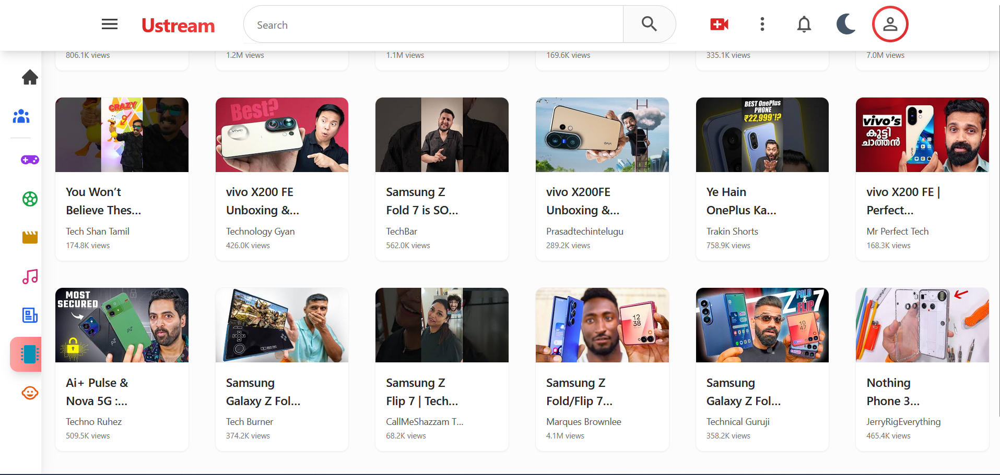

# 📺 Ustream
A modern, responsive YouTube-inspired video streaming web app built using **React**, **TailwindCSS**, and **YouTube Data API**. Features include video playback, related recommendations, dark mode, and sleek UI polish.

---

##  🖼️ UI Preview

---

## ✨ Features

- 🎥 Video player with real-time playback
- 📋 Recommendations section
- 🌗 Dark mode support
- 💨 Built with TailwindCSS for fast and responsive UI
- 📱 Fully responsive on all screen sizes
- 🧠 Clean and maintainable React component structure

---
## 🔨 Work to Be Done

Planned features and enhancements for future development:

- 🔍 **Search Functionality**  
  Implement video search using YouTube Data API with real-time results and keyword suggestions.

- 🔔 **Notification Panel**  
  Add a dropdown or sidebar panel to show new uploads or activity alerts from subscribed channels.

- 👥 **Subscriber Panel**  
  Show a list of subscribed channels with quick access and thumbnail previews.

- 👤 **User Page (Profile Page)**  
  - User avatar, name, and bio
  - Uploads/watch history (if available)
  - Subscribe/Unsubscribe logic
  - Dark mode and layout settings per user
---

## 🛠️ Tech Stack

- **Frontend:** React, TailwindCSS
- **Icons:** React Icons
- **Fonts:** Inter, Poppins, Roboto (via Google Fonts)
- **API:** YouTube Data API v3

---

## 💡 Edge Case Handling

*  Handles missing thumbnails with fallback backgrounds
*  Truncates overflowing titles and usernames
* Graceful dark mode support for all components

---

## 📜 License

MIT License © [Asgar Rashid](https://github.com/rumi-13)

---

## 🤝 Contributions

Pull requests and suggestions are welcome! Please open an issue to discuss any changes.

---

## 🙌 Acknowledgements

* YouTube Data API
* TailwindCSS Docs
* React Icons
* Google Fonts

